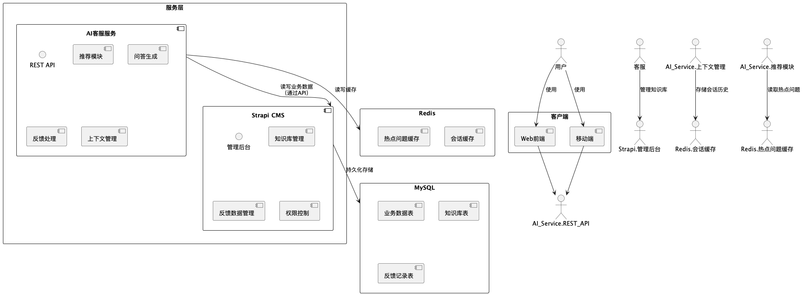

# AI 客服系统

> 基于 FastAPI + OpenAI + RAG 的智能客服解决方案

## 🚀 技术栈

### 核心框架
- **Web 框架**: FastAPI 0.108.0 + Uvicorn
- **AI 引擎**: OpenAI API (GPT)
- **向量数据库**: ChromaDB 0.4.22+
- **缓存存储**: Redis 5.0.1
- **CMS 集成**: Strapi API

### 数据处理
- **文本分析**: Jieba 0.42.1 (中文分词)
- **向量计算**: NumPy 1.26.4
- **数据验证**: Pydantic 2.5.3

### 任务调度
- **定时任务**: APScheduler 3.10.4
- **自动更新**: Schedule 1.2.1

## 📋 核心功能

### 🤖 智能对话
- 基于 RAG (检索增强生成) 的智能问答
- 上下文感知的多轮对话
- 会话历史管理和持久化

### 🔍 智能检索
- 向量语义搜索
- 知识库实时更新
- 搜索提示补全

### 📊 反馈系统
- 用户满意度收集
- 反馈数据分析
- 问答质量优化

### ⚙️ 系统管理
- 知识库增量/全量更新
- 任务调度监控
- 服务健康检查

## 🏗️ 系统架构

### 架构总览


### 目录结构
```
├── app/
│   ├── api/                    # API 路由层
│   │   └── routes.py          # REST API 接口
│   ├── core/                   # 核心配置
│   │   └── config.py          # 环境配置管理
│   ├── models/                 # 数据模型
│   │   └── schemas.py         # Pydantic 数据模型
│   ├── services/               # 业务服务层
│   │   ├── openai_service.py  # OpenAI API 集成
│   │   ├── rag_service.py     # RAG 检索服务
│   │   ├── strapi_service.py  # Strapi CMS 集成
│   │   ├── redis_service.py   # Redis 缓存服务
│   │   ├── hint_service.py    # 搜索提示服务
│   │   └── scheduler_service.py # 定时任务服务
│   └── data/                   # 数据存储目录
└── tests/                      # 测试用例
```

### UML 设计图


## 🔧 环境配置

### 必需环境变量
```bash
# OpenAI 配置
OPENAI_API_KEY=your_openai_api_key
OPENAI_API_URL=your_openai_api_url
OPENAI_AUTH_KEY=your_auth_key

# Redis 配置
REDIS_HOST=localhost
REDIS_PORT=6379
REDIS_PASSWORD=your_redis_password

# Strapi 配置
STRAPI_API_URL=your_strapi_url
STRAPI_API_TOKEN=your_strapi_token
```

### 可选配置
```bash
# 调试模式
DEBUG_MODE=false
SKIP_STRAPI_FETCH=false
SKIP_CHROMA_UPDATE=false
CLEAR_CHROMA_ON_STARTUP=false
```

## 🚀 快速开始

### 1. 环境准备
```bash
# 克隆项目
git clone <repository-url>
cd AI-customer-service

# 安装依赖
pip install -r requirements.txt
```

### 2. 配置环境
```bash
# 复制环境变量模板
cp .env.example .env

# 编辑环境配置
vim .env
```

### 3. 启动服务
```bash
# 开发环境
python run_app.py

# 生产环境
uvicorn app.main:app --host 0.0.0.0 --port 8000
```

## 📖 API 接口

### 聊天对话
```http
POST /chat
Content-Type: application/json

{
  "query": "用户问题",
  "session_id": "会话ID"
}
```

### 搜索提示
```http
POST /searchHint
Content-Type: application/json

{
  "query": "部分输入",
  "limit": 20
}
```

### 用户反馈
```http
POST /feedback
Content-Type: application/json

{
  "satisfaction": "满意度",
  "session_id": "会话ID",
  "feedback_id": "反馈ID"
}
```

### 知识库管理
```http
# 增量更新
POST /update-knowledge

# 全量更新
POST /update-knowledge/full

# 刷新搜索提示
POST /refresh-search-hints
```

## 🧪 测试

```bash
# 运行测试
pytest

# 测试覆盖率
pytest --cov=app
```

## 📝 开发指南

### 服务扩展
1. 在 `app/services/` 创建新服务模块
2. 在 `app/api/routes.py` 添加路由端点
3. 在 `app/models/schemas.py` 定义数据模型

### 定时任务
通过 `scheduler_service.py` 添加定时任务：
```python
@scheduler.scheduled_job('cron', hour=2)
def daily_update():
    # 定时任务逻辑
    pass
```

## 🔒 性能优化

- **Redis 缓存**: 会话历史和频繁查询缓存
- **向量检索**: ChromaDB 高效语义检索
- **异步处理**: FastAPI 异步 I/O 操作
- **连接池**: HTTP 客户端连接复用

## 🌟 特性亮点

- ✅ **高并发**: 异步处理架构支持高并发访问
- ✅ **智能检索**: 语义向量检索提高答案准确性  
- ✅ **实时更新**: 知识库自动同步和增量更新
- ✅ **扩展性**: 模块化设计便于功能扩展
- ✅ **监控**: 完整的日志和健康检查机制

## 📄 许可证

本项目采用 MIT 许可证 - 详见 [LICENSE](LICENSE) 文件 